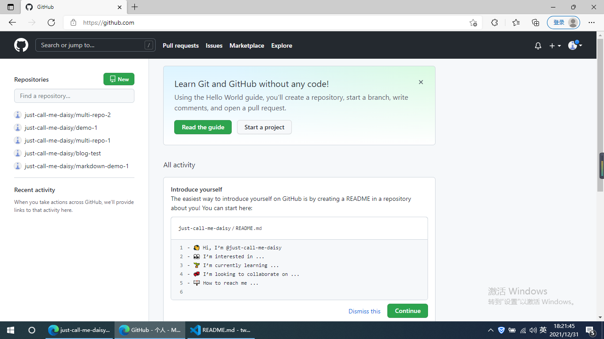

# 自我介绍

我叫Daisy，我的爱好是

1. 唱歌
2. 跳舞
3. 画画

我学过的编程语言有

* HTML
* CSS
* Javascript

我写一段给你瞧瞧吧

    var a = 1
    function f(){
        console .log('hello world')
    }
    f()

这是代码

``` css
body{
    background:red:
}
```

我的网站是[just-call-me-daisy](https://github.com/just-call-me-daisy)


